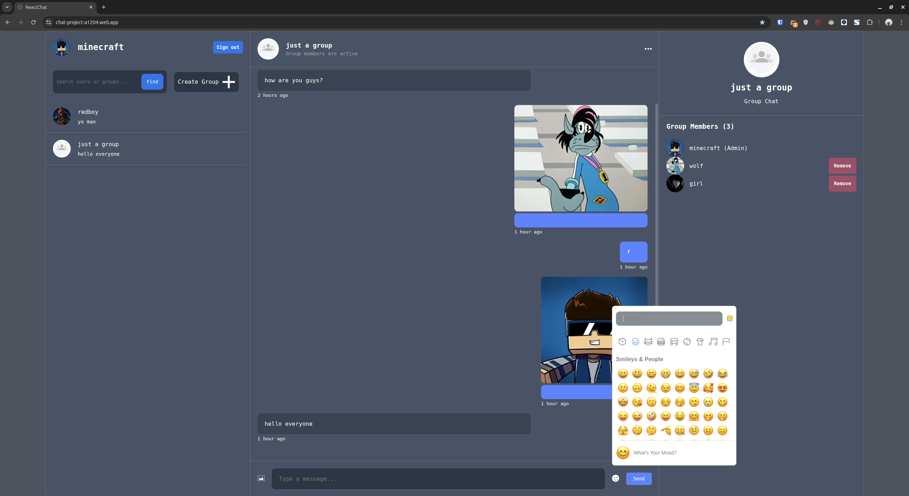

# Real-Time Chat Application

A modern real-time messaging platform built with **React** and **Firebase**.

---

## ✨ Features

* **Real-time Messaging:** Instant message delivery powered by Firebase Firestore.
* **One-on-One Chat:** Secure private messaging between users.
* **Group Management:** * Create new chat groups.
    * Join existing groups.
    * Participate in group-wide conversations.
* **User Discovery:** Search for and find other users and groups easily.
* **User Blocking:** Built-in privacy feature to block/unblock users.
* **Media Sharing:** Send and receive photos within any chat.
* **Emoji Support:** Emoji integration for better expression.

---

## Live demo

https://chat-project-a1204.web.app/

---

## Usage

I recommend creating two accounts to test the features, including one-on-one conversations and group functionality.

Warn: My app doesn’t really go well on small screens, as I focused on server-side Firebase and functionality.

---

## 🛠 Technologies Used

### Frontend


 


### Backend & Infrastructure


---

## 📦 Installation & Setup

To get a local copy up and running, follow these steps:

### 1. Clone the repository
```bash
git clone https://github.com/nessfolio/react-chat-app.git
cd react-chat-app
```

### 2. Install dependencies
```bash
npm i
```

### 3. Firebase Configuration

Configure your Firebase and add your keys to src/lib/firebase.js

### 4. Run the application
```bash
npm run dev
```

---

## 📸 Screenshot
